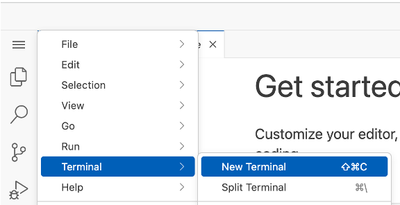
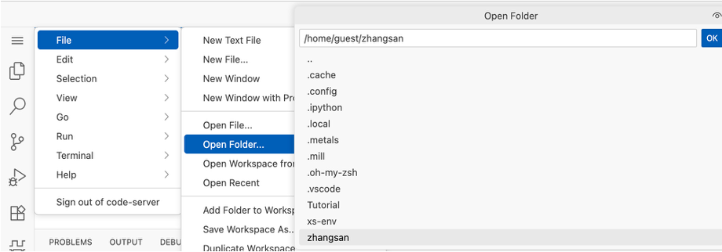
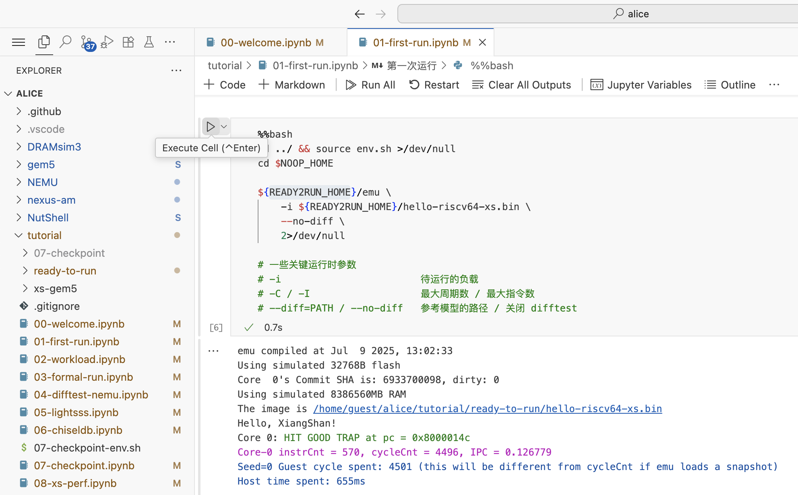

# 启动！

## 在线模式

在本教程中，我们将提供云服务器的访问权限，为您准备好香山开发环境，并介绍包括仿真、功能验证和性能验证在内的开发工作流程。我们为演示服务器安装了 [Code-Server](https://github.com/coder/code-server) 您只需要一台装有浏览器的电脑即可参与。

### 前置条件

登录到提供的云服务器。

**服务器仅在教程期间可用。**

1. 打开浏览器，访问 [https://xs.oscc.cc](https://xs.oscc.cc)。
2. 打开 Terminal

    点击左侧的 `≡` 菜单，打开 `Terminal`，选择 `New Terminal`。

    

3. 将 /opt/xs-env 复制到以你的名字命名的文件夹

    假设你叫`zhangsan`，在Terminal中输入以下命令：

    ```bash
    cp -r /opt/xs-env ~/zhangsan
    ```

4. 打开属于你的文件夹的工作区

    点击左侧的 `≡` 菜单，打开 `File`，选择 `Open Folder`，然后选择刚才复制的文件夹。

    

    !!! warning "注意"
        在 code server 中，工作区之间没有隔离，请务必打开属于自己的文件夹再进行其他操作。

### 上手实践

打开文件夹后，我们在左侧找到 `tutorial` 文件夹，找到 `01-first-run.ipynb` 文件，点击打开。

跟着文件找到最后的运行仿真的代码块，点击运行。



如果你看到了 Hello, XiangShan! 的输出，恭喜你，你已经成功运行了香山的第一个仿真程序。

继续跟着后续的几个 `.ipynb` 文件结合 Slides 进行实践吧。

## 离线模式

如果您希望在自己的服务器上构建香山环境，请参考以下操作。

请准备一台性能较高的服务器。以下是服务器的一些配置要求：

* 操作系统：Ubuntu 22.04 LTS（其他版本尚未测试，不推荐使用。**注意：**与 Ubuntu 20.04 LTS 对应的香山环境已不再维护。）
* CPU：不限。性能将决定编译和生成的速度。
* 内存：至少 32G，推荐 64G 或更高。
* 磁盘空间：20G 或更多。
* 网络：请配置流畅的网络环境。

详细步骤请参考：[xs-env](https://docs.xiangshan.cc/zh-cn/latest/tools/xsenv/)

**步骤 1：** 下载 `riscv-gnu-toolchain`。

详情请参考 [toolchain](https://docs.xiangshan.cc/zh-cn/latest/workloads/toolchain/)。

```bash
# 注意：请下载与您的环境兼容的工具链。这里以 Ubuntu 22.04 为例。
wget https://github.com/riscv-collab/riscv-gnu-toolchain/releases/download/2025.01.20/riscv64-glibc-ubuntu-22.04-gcc-nightly-2025.01.20-nightly.tar.xz
wget https://github.com/riscv-collab/riscv-gnu-toolchain/releases/download/2025.01.20/riscv64-elf-ubuntu-22.04-gcc-nightly-2025.01.20-nightly.tar.xz
sudo tar -xJf riscv64-glibc-ubuntu-22.04-gcc-nightly-2025.01.20-nightly.tar.xz -C /opt
sudo tar -xJf riscv64-elf-ubuntu-22.04-gcc-nightly-2025.01.20-nightly.tar.xz -C /opt

# 设置环境变量
vim ~/.bashrc
# 在文件末尾添加 `export PATH=/opt/riscv/bin:$PATH`。

# 更新环境变量
source ~/.bashrc
# 检查状态
riscv64-unknown-linux-gnu-gcc --version
riscv64-unknown-elf-gcc --version
```

**步骤 2：** 克隆环境并安装工具。

```bash
# 克隆 xs-env
git clone https://github.com/OpenXiangShan/xs-env
cd xs-env
git checkout rvsc2025-tutorial
# 使用 apt 安装依赖项，您可以根据需要修改为其他包管理器
sudo -s ./setup-tools.sh
# 准备工具，使用一个小项目测试开发环境
source setup.sh
source env.sh
```

**步骤 3：** 复制附件

本步骤中的一些预构建程序仅适用于 Ubuntu-22.04。
如果您在其他发行版中遇到问题，可以尝试自行编译相应的程序。

```bash
pushd $XS_PROJECT_ROOT/tutorial/xs-gem5/data
wget https://github.com/OpenXiangShan/xs-env/releases/download/rvsc25-tutorial/gem5-data.tar.zstd
tar -xvf gem5-data.tar.zstd
popd
pushd $XS_PROJECT_ROOT/tutorial/ready-to-run
wget https://github.com/OpenXiangShan/xs-env/releases/download/rvsc2025-tutorial/ready-to-run.tar.gz
tar -xvf ready-to-run.tar.gz
popd
```

**步骤 4：** 安装必要的 Python 库。

```bash
pip install -r $NOOP_HOME/scripts/requirements.txt
```
