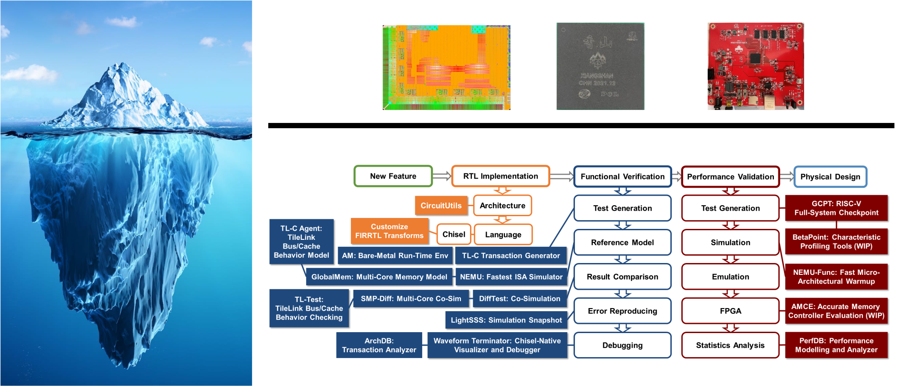

# Tutorials @ 2025 RISC-V 中国峰会

我们将在 [2025 RISC-V 中国峰会](https://riscv-summit.com/) 的同期活动第二届香山开源社区大会上举办一个关于香山处理器与对应GEM5模拟器的开发工具与敏捷验证的教程。香山开源社区大会将于7月16日下午13:30在[上海张江科学会堂](https://j.map.baidu.com/ab/JeHJ) 402会议室 举行。

如果你正在现场参与本次活动，请从 [启动！](StartUp.md) 页面开始。

## Agenda

**时间: 下午 13:30, 星期三, 7月16日**

**地点: 张江科学会堂 402会议室**

| 时间          | 报告题目                                      | 幻灯片  |
| ------------- | ------------------------------------------- | ------ |
| 13:30 - 14:00 | 香山：迈向产业实践的开源高性能 RISC-V 处理器      |        |
| 14:00 - 14:20 | XSAI: Hardware Support for Modern LLM Kernels in a CPU Paradigm |        |
| 14:40 - 15:00 | 颁奖典礼                                     |        |
| 15:00 - 15:20 | 香山昆明湖V3前端架构                           |        |
| 15:20 - 15:40 | 香山昆明湖后端流水线的设计演进                   |        |
| 15:40 - 16:00 | 香山昆明湖缓存、访存的设计演进                   |        |
| 16:00 - 17:30 | 香山 Tutorial + 万众一芯                      | [香山Tutorial](./slides/20250716-RVSC25-XiangShan-Tutorial.pdf) |

## XiangShan：面向架构研究的开源高性能 RISC-V 处理器与基础设施

过去十年，敏捷开源硬件在学术界和工业界都日益受到关注。2019 年，SIGARCH 愿景研讨会“面向下一代计算的敏捷开源硬件”与 ISCA 联合举办，邀请了 11 位专家就此方向发表各自的看法。我们相信，开源硬件设计，更重要的是，免费开放的开发基础设施，有机会为架构研究带来更多便利，并激发创新。

在本次 Tutorial 中，我们将介绍我们在 XiangShan 项目上的成果。XiangShan 是一款开源、具有行业竞争力的高性能 RISC-V 处理器。它突破了公共处理器的性能上限，并为未来的计算机架构研究奠定了竞争基础。此外，我们还构建了一个名为 MinJie 的敏捷开发平台，该平台集成了丰富的开发工具作为基础设施。我们将展示 XiangShan 如何与 Minjie 携手，帮助研究人员敏捷地实现他们的创新想法并获得令人信服的评估结果。我们的研究成果此前已在 MICRO’22 会议上发表，并被评为 2022 年计算机体系结构会议的 IEEE Micro Top Pick。

本教程的主要目标是展示香山项目如何使架构研究更加便捷和扎实。香山一直在名为“MinJie”的敏捷硬件开发平台上进行开发。我们相信“MinJie”有潜力成为计算机架构研究人员最重要的基础设施之一。在本教程中，我们将指导读者如何在香山上进行敏捷设置、定制或研究，并获得准确且令人信服的评估结果。

目标受众包括架构设计、敏捷开发等领域的研究人员。

我们为 XiangShan 提供了一个快速启动环境。有关详细信息，请参阅 [StartUp](StartUp.md) 页面。

## 我们将介绍
- 香山项目简介

2020年6月，我们启动了香山项目。我们已经开发了两代处理器，分别代号为雁栖湖和南湖。目前最新版本的香山处理器在我们所知范围内达到了开源 RISC-V 处理器的最高性能。我们正在开发第三代处理器，代号为南湖，目标是实现更高的性能。我们还将介绍香山的流片状态、性能评估以及未来的路线图等内容。

- XS-Gem5 模拟器简介

XS-GEM5 是一个基于开源 GEM5 框架构建的架构模拟器，与香山 RTL 架构进行了校准。它支持全系统（FS）模拟，并通过 RVGCpt 实现快速性能评估。它使我们能够快速进行设计空间探索和参数优化。我们还将展示一个快速添加新功能的示例。

- 香山处理器的微架构与设计理念简介

香山是一款支持 RV64GCBK 指令集的超标量乱序执行 RISC-V 处理器。第三代 KMH 将支持向量扩展和虚拟化扩展。它具有高吞吐量的前端，配备先进的分支预测器、六路激进的乱序执行引擎、高带宽的加载/存储单元以及高度可配置的缓存系统。香山使用高级硬件描述语言 Chisel 编写，具有高可读性和可维护性。

- 香山开发基础设施简介

我们将介绍香山处理器的开发基础设施，也称为 MinJie 平台。MinJie 是开源的，包含一系列工具，可以加速硬件开发、功能验证和性能评估的过程。我们将首先介绍 MinJie 工具集的原理和使用说明，然后演示如何利用这些工具快速开发香山处理器。

- 基于香山和 MinJie 的典型用例实践

我们已经建立了一套完整的工作流程，用于模拟香山处理器并在 FPGA 上进行原型验证。在这一部分，我们将进行实际演示，包括参数细节和需要注意的关键点。我们将展示一些香山开发的典型案例，例如如何添加一条指令、如何添加一个外设设备以及如何重新配置缓存结构。基于香山和 MinJie 平台，许多架构研究工作可以被复现，并加速学术界与工业界的互动。
