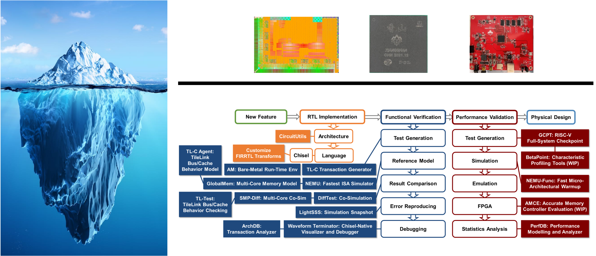

# Tutorials at HPCA'25

We are going to host half-day tutorials on XiangShan and MinJie during HPCA'25 in Las Vegas, USA on March 2, 2024.

## Agenda

**Time: Morning, Sunday, March 2**

| Time          | Topic                                       | Slides                   |
| ------------- | ------------------------------------------- | ------------------------ |
| 08:30 - 09:00 | Introduction of the XiangShan Project       | Available on 28 Feburary |
| 09:00 - 10:00 | Microarchitecture Design and Implementation | Available on 28 Feburary |
| 10:00 - 10:30 | Coffee Break                                |                          |
| 10:30 - 12:00 | Hands-on Development                        | Available on 28 Feburary |

## XiangShan: An Open Source High Performance RISC-V Processor and Infrastructure for Architecture Research

Over the past decade, agile and open-source hardware has gained increasing attentions in both academia and industry. In 2019, the SIGARCH Visioning Workshop “Agile and Open Hardware for Next-Generation Computing” in conjunction with ISCA invited eleven experts to present their visions on this direction. We believe that open-source hardware design, and more importantly, free and open development infrastructure, has the opportunity to bring more convenience to architecture research and stimulate innovations.

In this tutorial, we will present our efforts on the XiangShan project. XiangShan is an open-source, industry-competitive, high performance RISC-V processor. It has raised the performance ceiling of publicly accessible processors and set the competitive groundwork for future computer architecture research. Besides, we build an agile development platform called MinJie that integrates a broad set of development tools as infrastructure. We will demonstrate how XiangShan, together with MinJie, helps researchers realize their innovative ideas agilely and obtain convincing evaluation results. Our work was previously published at the MICRO’22 conference, selected as an IEEE Micro Top Pick from the 2022 Computer Architecture Conferences.

The major goal of the tutorial is to demonstrate how the XiangShan project can make architecture research more convenient and solid. XiangShan has been developing on an agile hardware development platform called MinJie. We believe MinJie has the potential to become one of the most important infrastructures for computer architecture researchers. In this tutorial, we will guide audience how to setup and make customization or do research on XiangShan agilely and obtain accurate and convincing evaluation results.

Target audience includes researchers on architecture design, agile development, etc.

We provide a quick-start environment for Xiangshan. See [StartUp](StartUp.md) page for details.

## To be covered

- Introduction to the XiangShan project

In June 2020, we launched XiangShan project. We have developed two major generations of codenamed YQH and NH respectively. The latest version of XiangShan processor achieves the highest performance of open-source RISC-V processors to the best of our knowledge. There is an on-going third generation called KMH targeting higher performance. We will also cover XiangShan tape-out status, performance evaluation, future roadmap, etc.

- Introduction to the microarchitecture and design concepts of XiangShan processor

XiangShan is a superscalar out-of-order RISC-V processor with RV64GCBK ISA support. Vector and Hypervisor extensions are to be supported in the 3rd generation KMH. It features high-throughput frontend with advanced branch predictor, six-way aggressive out-of-order execution engine, high-bandwidth load/store unit and highly configurable cache system. Written in Chisel, a high-level hardware description language, XiangShan also achieves high readability and maintainability.

- Introduction to the infrastructures for XiangShan development

We will introduce the development infrastructure of XiangShan processor, also known as the MinJie platform. MinJie is open sourced as well. It includes a series of tools that can accelerate the process of hardware development, functional verification, and performance evaluation. We will first talk about the principles and instructions of MinJie toolsets, and then demonstrate how to employ these tools to help quickly develop XiangShan processor.

- Hands-on development with typical use cases on XiangShan and MinJie

We have established a comprehensive workflow to simulate XiangShan processor and do prototype on FPGA. In this part, we will perform a practical demonstration, including argument details and key points to pay attention to. We will present some typical cases for XiangShan development. For example, how to add an instruction, how to add a peripheral device and how to re-configure cache structure. Based on XiangShan and Minjie platform, many architectural works can be reproduced and accelerate the interactions between academia and industry.

This tutorial's primary hands-on encompasses two parts: 

- [Function Verification](FunctionVerification.md)

- [Performance Analysis](performance.md)
